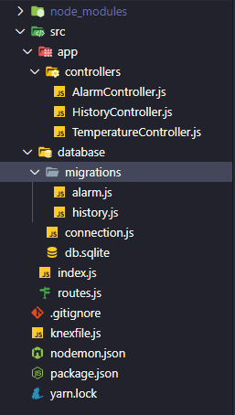
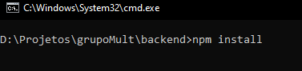
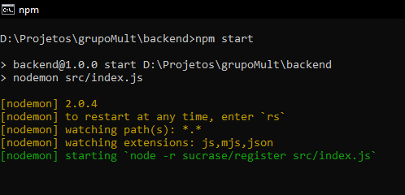

<h3 align="center"> Backend construído em  NodeJS

---

Desafio para construção de um sistema de temperaturas. Leia <a href='https://github.com/marcomonteirobrito/temperatura-nodejs-reactjs' target='_blank'>aqui</a> para detalhes do desafio.

## Estrutura 

<p align="center">
	
</p>

<h2><strong>:satellite: Algumas das tecnologias utilizadas*</strong></h2>

<h3>Backend (NodeJS)</h3>
<li>Axios (Requisições)</li>
<li>Sqlite3 (Banco de dados)</li>
<li>ExpressJS</li>
<li>knexJS (ORM)</li>

<h6>* Para verificar todas tecnologias, acesse o package.json</h6>

### Instalando e executando backend

Execute o comando ```npm install``` na raiz da pasta do projeto frontend para instalar as dependências.  
<div align="center" >
 
</div>

Após executado o código acima, execute o comando ```npm start``` na raiz do projeto. 
<div align="center" > 

</div>

<h3>Obs*: Será executado na rota localhost:3333. </h3> 

<h4>Dúvidas entre em contato pelo <a href="https://www.linkedin.com/in/marco-antonio-monteiro-de-brito-541ba0144/" target="_blank">Linkedin</a> </h4>

<h4 align="center"> <em>&lt;/&gt;</em> by <a href="https://github.com/marcomonteirobrito" target="_blank">marcomonteirobrito</a> </h4>