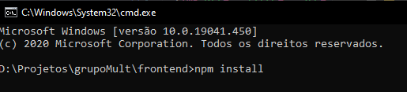

<h3 align="center"> Frontend construído em  ReactJS

---

Desafio para construção de um sistema de temperaturas. Leia README.md para detalhes do desafio.

## Telas aplicação web 

<p align="center">
	
	
	
	
	
</p>

<h2><strong>:satellite: Algumas das tecnologias utilizadas*</strong></h2>

<h3>Versão Web (ReactJS)</h3>
<li>Axios (Requisições)</li>
<li>React Icons</li>
<li>React Router Dom (Roteamento)</li>
<li>Moment (datas)</li>
<li>Styled Components (CSS)</li>

<h6>* Para verificar todas tecnologias, acesse o package.json</h6>

### Instalando aplicação frontend

Execute o comando ```npm install``` na raiz da pasta do projeto frontend para instalar as dependências.  
<div align="center" >
 
</div>

Após executado o código acima, execute o comando ```npm start``` na raiz do projeto.  
<div align="center" >

</div>

<h3>Obs*: Será executado na rota localhost:3000. </h3> 
<h3>Obs**: Certifique-se que o backend está executando. </h3>

<a href='https://github.com/marcomonteirobrito/temperatura-nodejs-reactjs/tree/master/backend' target='_blank'>Backend</a>

<h1 align="center">
    
</h1>

Dúvidas entre em contato pelo <h4 align="center"> <a href="https://www.linkedin.com/in/marco-antonio-monteiro-de-brito-541ba0144/" target="_blank">Linkedin</a> </h4>

<h4 align="center"> <em>&lt;/&gt;</em> by <a href="https://github.com/marcomonteirobrito" target="_blank">marcomonteirobrito</a> </h4>